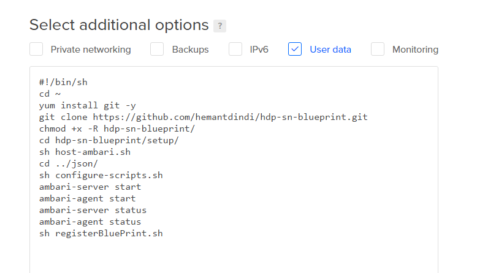
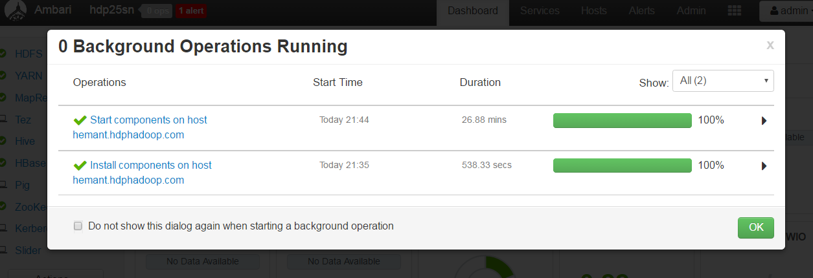

# hdp-sn-blueprint

#This is tested in a CentOS 7 64 Bit Server on a Digital Ocean Droplet

The below script will configure your single host with all the pre-requisites for a single node HDP 2.5 instance.
It will setup passwordless-ssh, install ambari-server, ambari-agent, setup kdc and configure as per you node details.

When you create the Droplet, ensure that in the User Data section, you add the script as below - 

 

			#!/bin/sh
			cd ~
			yum install git -y
			git clone https://github.com/hemantdindi/hdp-sn-blueprint.git
			chmod +x -R hdp-sn-blueprint/
			cd hdp-sn-blueprint/setup/
			sh host-ambari.sh
			cd ../json/
			sh configure-scripts.sh
			ambari-server start
			ambari-agent start
			sh registerBluePrint.sh

Login to the droplet with credentials [root/hadoophdp]
	
	tail -f /var/log/cloud-init-output.log
   
You should see a the below output at the end -

      {
      "href" : "http://hemant.hadoophdp.com:8080/api/v1/clusters/hdp25sn/requests/1",
      "Requests" : {
      "id" : 1,
      "status" : "Accepted"
       } 
     }Cloud-init v. 0.7.5 finished at Sun, 05 Mar 2017 15:34:48 +0000. Datasource DataSourceDigitalOcean.  Up 296.53 seconds

Please login to ambari using the default[admin/admin] credentials. You should see the progress of installation.
 

  

