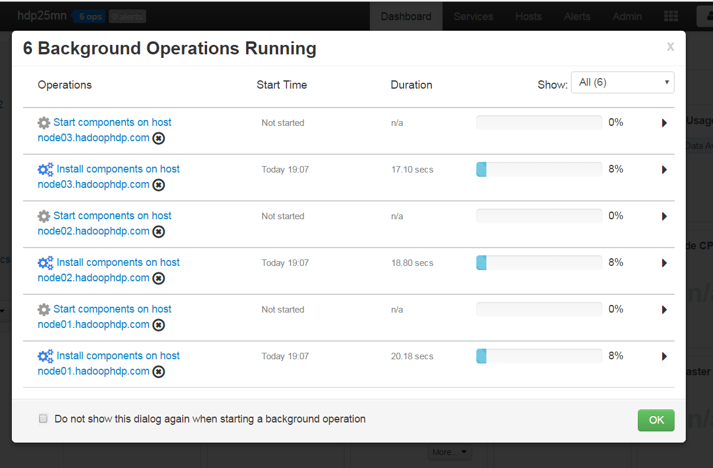
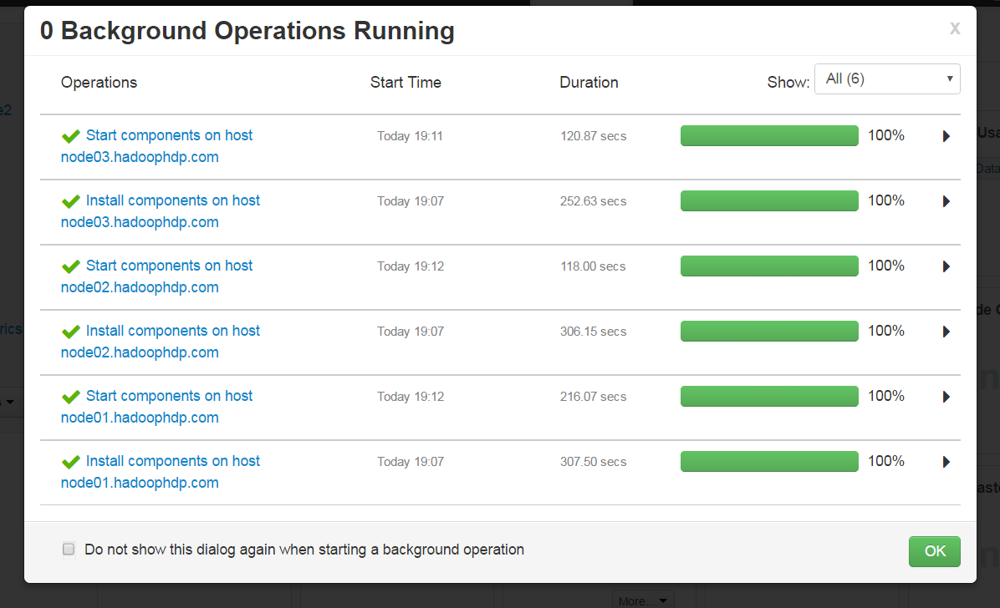
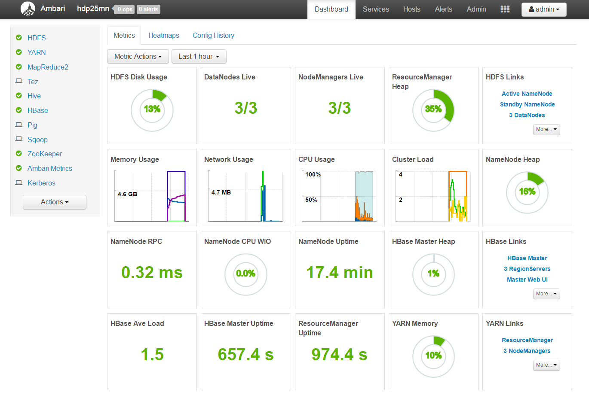
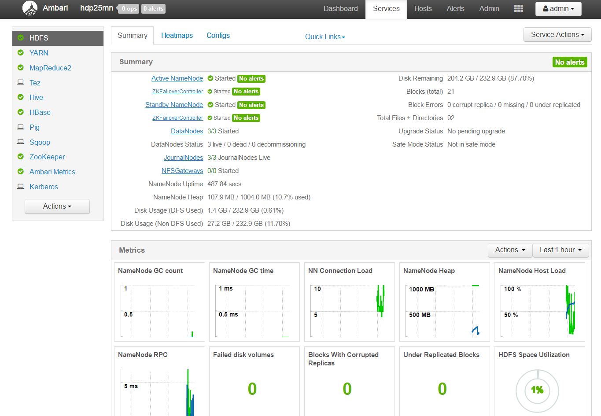

# HDP multinode installation using Ambari Blueprints with Kerberos and HA.

##This is tested in a CentOS 7 64 Bit Servers hosted in Digital Ocean

Note that the hostnames are as below - 

* node01.hadoophdp.com 
* node02.hadoophdp.com 
* node03.hadoophdp.com 

node01.hadoophdp.com acts as the ambari server.

##### On node01, execute the script - setup-ambari-server.sh
##### On node02, node03, execute the script - setup-ambari-agent.sh

_At this point ambari-agent's are not started._
_Ensure DNS/Rev. DNS is working among the nodes, else modify /etc/hosts on all hosts as per your IP's_

In my case, I updated /etc/hosts 

##### Start Ambari Server
##### Start Ambari Agent on all the hosts
_Ensure ambari-server and ambari-agent's are running_

Follow the below steps on Ambari-server - 

      yum install git -y
      git clone https://github.com/hemantdindi/hdp-ambari-blueprints.git
      cd hdp-ambari-blueprints/hdp-ha-with-kerberos/json/
      chmod +x *
      ./configure-scripts.sh
      ./registerBluePrint.sh

You should a output similar to this - 

      [root@node01 json]# ./registerBluePrint.sh
      {
        "href" : "http://node01.hadoophdp.com:8080/api/v1/clusters/hdp25mn/requests/1",
        "Requests" : {
          "id" : 1,
          "status" : "Accepted"
        }
      }

:+1: :+1: 

##### If all goes well, login to ambari and you will see the progress similar as below - 

